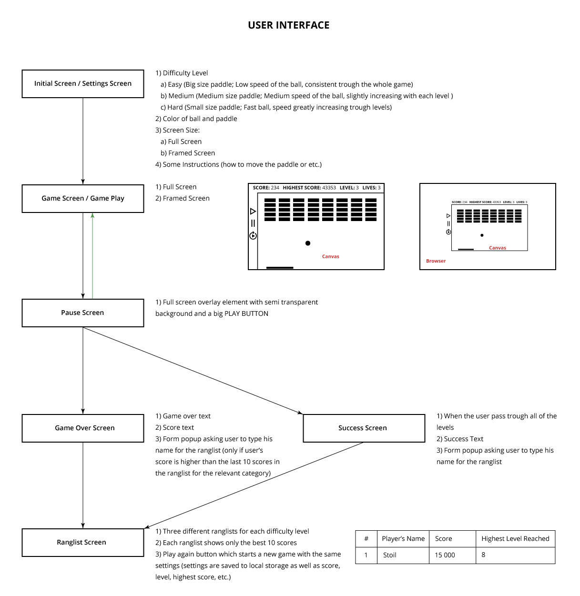
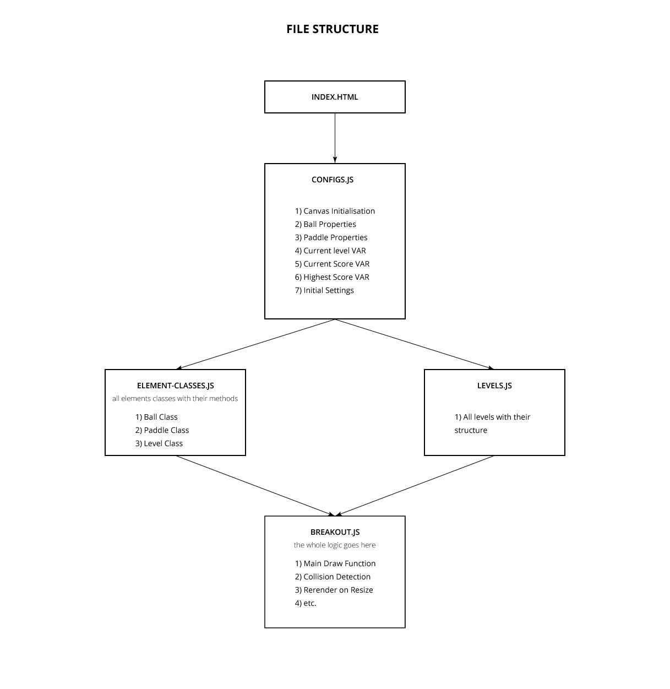

# 2D_breakout_game_project
Frontend JavaScript Project Assignment

### 2D BREAKOUT GAME PROJECT SPECIFICATIONS LIST

1. Landing page/window
  1. Show settings options
    1. Difficulty level (Each difficulty level adjusts the speed of the ball and/or the number of bricks to break)
      1. Easy
      2. Medium
      3. Hard
    2. Number of brick rows/cols or just a number of bricks (It may be waived if we have different bricks arrangements for each new level)
    3. Size of canvas screen
  2. Show game instructions
  3. Play button which will take preconfigured/default settings if user does not make any changes before pressing the play button
2. Actual game play page/window
  1. Some cool background
  2. Canvas screen taking up the predefined size from the initial settings
  3. Settings Bar
    1. Play/Pause button
    2. Stop/Leave game button
    3. See Ranglist button
    4. Instructions button
    5. Settings button (Someone might want to change the color of bricks/ball while he is playing)???
3. Success page/window (The page which will show only if the Player has completed all levels)
4. Game over page/window
5. Ranglist popup form
6. Ranglist page/window (It should lists the best 10 players in each Difficulty level. The Ranglist should be sorted by score)

### PROJECT ARCHITECTURE SUGGESTION

1. UI Structure:

2. File Structure:
  1. JS folder
    1. configs.js
    2. levels.js
    3. element.classes.js
    4. breakout.js
  2. CSS folder
    1. main.css
  3. index.html
  

  ### TASKS ASSIGNMENTS SUGGESTION

  VERA MANOVA       -> CONFIGS.js / CLASSES.js
  
  RAYA FOTEVA       -> LEVELS.js / CLASSES.js
  
  STOIL KOSTADINOV  -> UI (GAME SCREENS/SETTINGS/LOCAL STORAGE)
  
  DESISLAVA PETKOVA -> BREAKOUT.js
  
  DENISLAV VEIZOV   -> BREAKOUT.js
